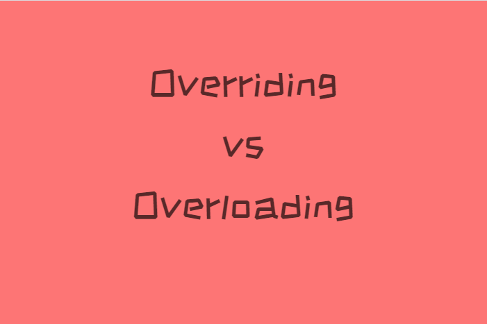
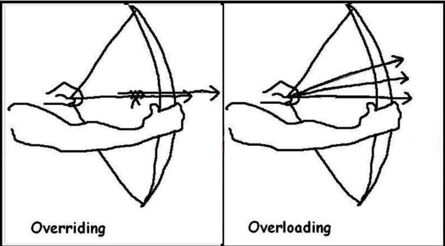

- [What is Overriding](#what-is-overriding)
- [What is Overloading](#what-is-overloading)
- [Conclusion](#conclusion)

We can override or overload a method in an object-oriented programming language (e.g., Java). However, most people are confused about these two terms.

I remember one of my job interview with a big company in Vancouver. The interviewer asked me what is overriding and overloading. I like this question because this is a good topic that illustrates an interviewee's understanding of object-oriented programming.

## What is Overriding

Overriding is when we re-implement the same method in the subclass. Therefore, the overridden method will have the same name, same return type, and the same parameter list.

For example, we have a class called Bird and a subclass called Penguin. Penguins are birds, so we can let the class Penguin extends the class Bird.

The class Bird has a method called fly(). Since the class Penguin is a subclass of Bird, it inherits the method fly(). However, penguins cannot fly, so we need to override (re-implement) this method fly() in the Penguin class.

```java
class Bird {

    public void fly() {
        System.out.println("Flying");
    }

}

class Penguin extends Bird {

    @Override
    public void fly() {
        System.out.println("Cannot fly");
    }

}
```

As a result, if we have an object of Penguin, the JVM will call the overridden method defined in the class Penguin.

```java
public class Main {
    public static void main(String[] args) {
        Bird penguin = new Penguin();
        penguin.fly(); // Output: Cannot fly
    }
}
```

There is one interesting thing. Although the object type is Bird, the JVM will still call the overridden method fly() defined in the Penguin class because JVM will check the actual type of the instance during the application run time.

That is the power of overriding. When we want to enjoy the benefit of polymorphism (e.g., declaring Penguin as type Bird), we do not need to worry about the actual type of the instance because the JVM will check that for us during the run time and call the proper methods.

## What is Overloading

Overloading has nothing to do with polymorphism. When we talk about overloading, we talk about defining the same method again in the same class, but with different parameter lists.

Overloading is a technique when we want to accept different parameters but achieve the same goal. For example, my friend Tom can play his favorite pc game League of Legends, or I can ask him to play a specific game with me.

```java
class Tom {
    public void play() {
        System.out.println("Playing League of Legends");
    }

    public void play(String name) {
        System.out.println("Playing " + name);
    }
}
```

Since playing the favorite game or playing other games are all about play, we can use the same method name to keep clarity. Both methods can exist in the same class since the compiler can recognize them by looking at their parameter list, aka signature.

## Conclusion



Overriding and overloading are different things, although their names look similar. It is essential to understand the difference.

Overriding is about a subclass re-implementing a method in the parent class. The JVM will call the method of the actual instance regardless of the declared type.

Overloading is defining the same method in the same class with different parameter lists. Both methods can exist in the same class because the compiler can distinguish them by their signatures.
