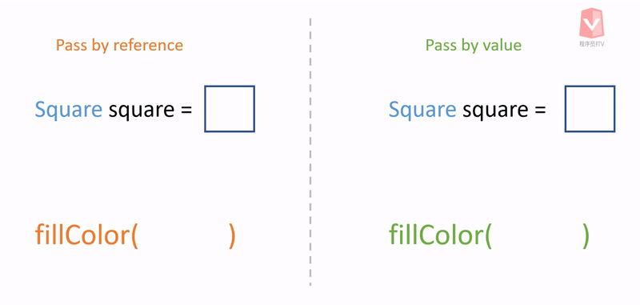

We can pass a reference or a value to a function. Passing references or passing values are different things, and it is essential to understand the difference.



## Pass by Values

If a function accepts primitive type data as its parameters, the data are passed by values, which means the function receives new copies of the data. 

Therefore, even if we do something inside the function that alters the value, it does not affect the origin of the value.

```java
public static void plusFive(int a) {
    a = a + 5;
}

public static void main(String[] args) {
    
    int a = 6;

    plusFive(a);
    
    System.out.println(a); // Output: 6
}
```

As can be seen from the codes, we declare an integer variable that holds a value of 6 in the main function. 

Then, we pass this integer to the plusFive() function. The plusFive() function adds a value of 5 to the integer and re-assign the variable that holds the integer. 

After that, we print out the variable that we have declared in the main function; the value of the variable is still 6, not 11, because the value we have altered inside the function is a copy.

## Pass By References

A reference is an address that is pointing to the actual location of an object. Therefore, if we modify the object through the **same reference**, it impacts the same object.

```java
public static void main(String[] args) {

    Person person = new Person();

    Person Tom = person;
    Person Kevin = person;

    Tom.name = "Tom";
    Kevin.name = "Kevin";

    System.out.println(Tom.name);
    System.out.println(Kevin.name);

    // Output:
    // Kevin
    // Kevin

}
```

The variables Tom and Kevin hold the same reference of a Person object. As a result, all changes affect the same object, so we see the output is Kevin and Kevin.

If we pass an object to a function, we pass a reference of the object to the function. Therefore, there is only one copy of the object. If we use the reference to modify anything, it impacts the origin of the object.

```java
public static void changeName(Person person) {
    person.name = "new name";
}

public void static main(String[] args) {

    Person person = new Person();
    person.name = "old name";

    changeName(person);

    System.out.println(person.name); // Output: new name
}
```

We have an object of Person, and we assign a value of  "old name" to person.name. 

Then, we pass the Person object to changeName() function. The changeName() function re-assigns a new value of "new name" to person.name

After that, we print out person.name and the output is "new name".

## Conclusion

Passing by values means that a function receives a new copy of data. Therefore, any changes to the new copy of data do not affect the original data.

Passing by references means that a function receives the location of the data. As a result, any changes through the reference impact the same data.
