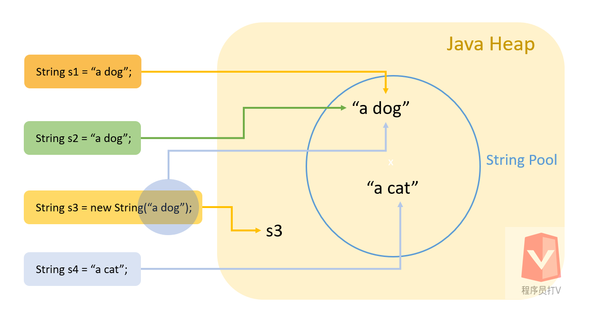

# String Class in Java

String is a class in Java programming language. When we create a String, we create an object of String class, and this is different than primitive data types.

Primitive data types are built-in types in the programming language. On the other hand, objects are like containers that hold a combination of data.

For example, unlike primitive data types, String objects have methods like length() and equals().

```java
public static void main(String[] args) {

    String s = "I am a string";

    // String objects contain methods length() and equals()
    s.length();
    s.equals("I am a string");

}
```

The String class holds an array of characters. When we are printing a string object, it will copy the array of characters contained in the string object and pass them to the system writer.

## String Pool



String Pool is a place in java heap memory where it stores some shared String objects. 

When we use String literal, the JVM will first check the String Pool if there is an existing String object that has the same value. If so, the JVM will re-use the existing String object. Otherwise, the JVM creates a new String object and stores it in the String Pool.

If we use the keyword **new**, the JVM will create a new String object without checking the String Pool. Also, it will not store the new String object in the String Pool either.

```java
public static void main(String[] args) {

    // String literal will be cached in the String Pool
    String s1 = "a dog";

    // A new String object is created
    String s2 = new String("a dog");

}
```

## Immutable

String class is immutable because we cannot modify the data or make a subclass of a String object for security reasons.

We are not allowed to modify a String object because the system caches some String objects in the String Pool. Therefore, there are many clients share a single String object. If we change the String object in one place, it will affect other places and create undesirable effects.

As a result, when we are doing String concatenation, a new String object is created instead of modifying the existing String objects.

```java
public static void main(String[] args) {

    String s1 = "Hello";
    String s2 = "World";

    // A new String object is created
    String s3 = s1 + s2;

}
```

A common mistake is that when we call replace() method to replace a character from a String, we do not assign the new returned String to a variable; instead, we thought the original String was modified.

```java
public static void main(String[] args) {

    String s = "Hellw";

    // A new String object is returned but we do not assign it to a variable
    s.replace('w', 'o');

    // Output: Hellw, because original String is not changed
    System.out.println(s); 

    
    // The right way is to store the returned String
    s2 = s.replace('w', 'o');

    // Output: Hello
    System.out.println(s2);

}
```

## Comparing Strings

When we compare two String objects, we need to use .equals() method because == operator compares the references of the two String objects instead of their values.

```java
public static void main(String[] args) {

    String s1 = new String("a dog");
    String s2 = new String("a dog");

    // False because == is comparing object references
    System.out.println(s1 == s2);

    // True because equals() method compares their values
    System.out.println(s1.equals(s2));
}
```

Also note that if we use String literal, the String object is cached in the String Pool. Therefore, we may get true when using == to compare two Strings. However, if what we care about is the String values, then we should always use equals() method to compare String objects.

```java
public static void main(String[] args) {

    String s1 = "a dog";
    String s2 = "a dog";

    // True because this String object is cached in the String Pool
    System.out.println(s1 == s2);

}
```

## An Interview Question

There is an interview question about the String Pool. 

How many String object(s) are created by the following code?

```java
String s = new String("a dog");
```

The answer depends on the actual context. The String literal "" creates a new String object in the String Pool if there is no existing String object that has the same value. Also, the keyword **new** creates another String object by passing the String literal to the String constructor.

As a result, the answer is one or two new String objects are created.
